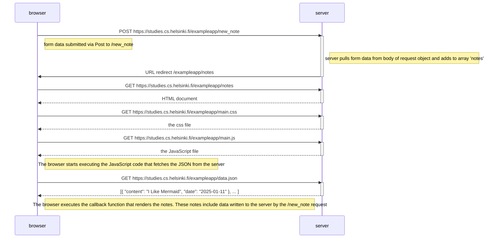

```mermaid
sequenceDiagram
    participant browser 
    participant server

    browser->>server: POST https://studies.cs.helsinki.fi/exampleapp/new_note
    activate server

    Note right of browser: form data submitted via Post to /new_note
    Note right of server: server pulls form data from body of request object and adds to array 'notes'

    server->>browser: URL redirect /exampleapp/notes
    deactivate server

    browser->>server: GET https://studies.cs.helsinki.fi/exampleapp/notes
    activate server
    server-->>browser: HTML document
    deactivate server

    browser->>server: GET https://studies.cs.helsinki.fi/exampleapp/main.css
    activate server
    server-->>browser: the css file
    deactivate server

    browser->>server: GET https://studies.cs.helsinki.fi/exampleapp/main.js
    activate server
    server-->>browser: the JavaScript file
    deactivate server

    Note right of browser: The browser starts executing the JavaScript code that fetches the JSON from the server

    browser->>server: GET https://studies.cs.helsinki.fi/exampleapp/data.json
    activate server
    server-->>browser: [{ "content": "I Like Mermaid", "date": "2025-01-11" }, ... ]
    deactivate server

    Note right of browser: The browser executes the callback function that renders the notes. These notes include data written to the server by the /new_note request

```
